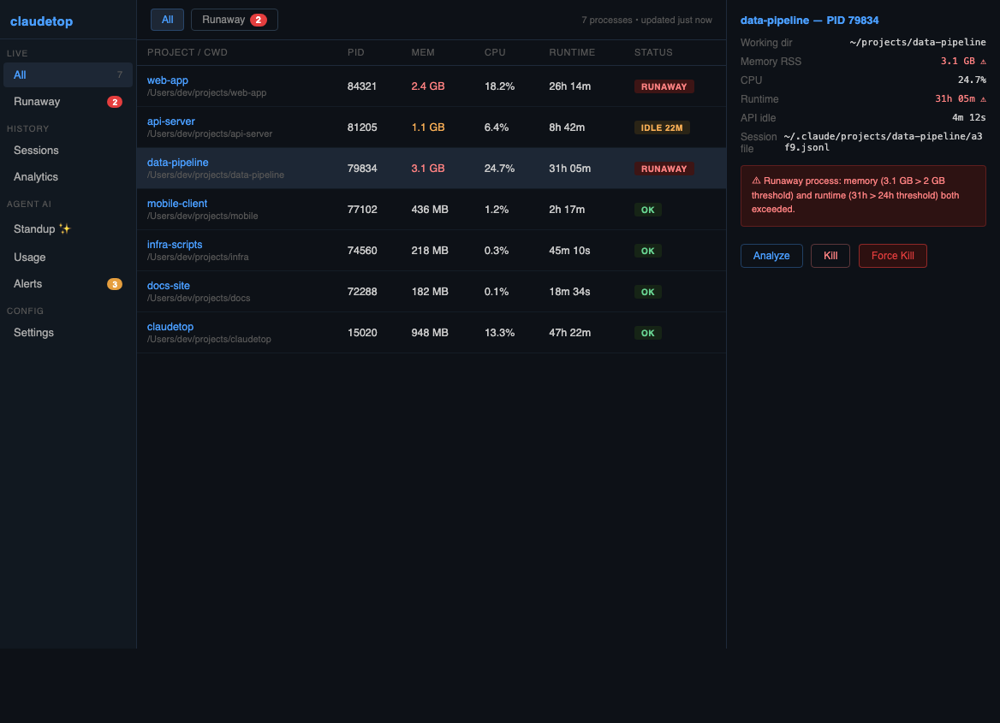
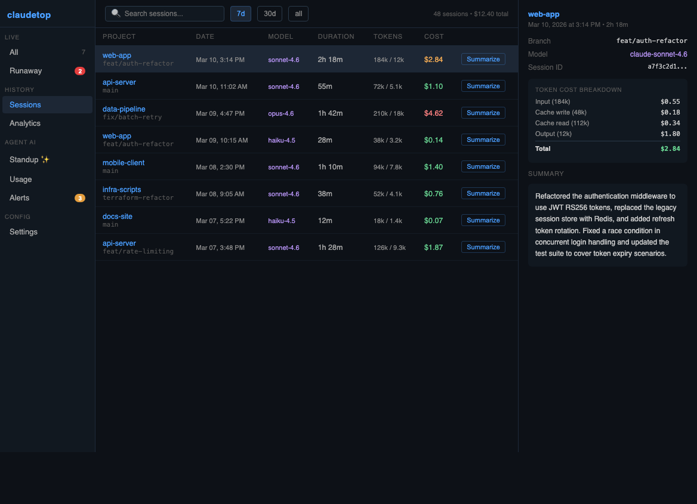
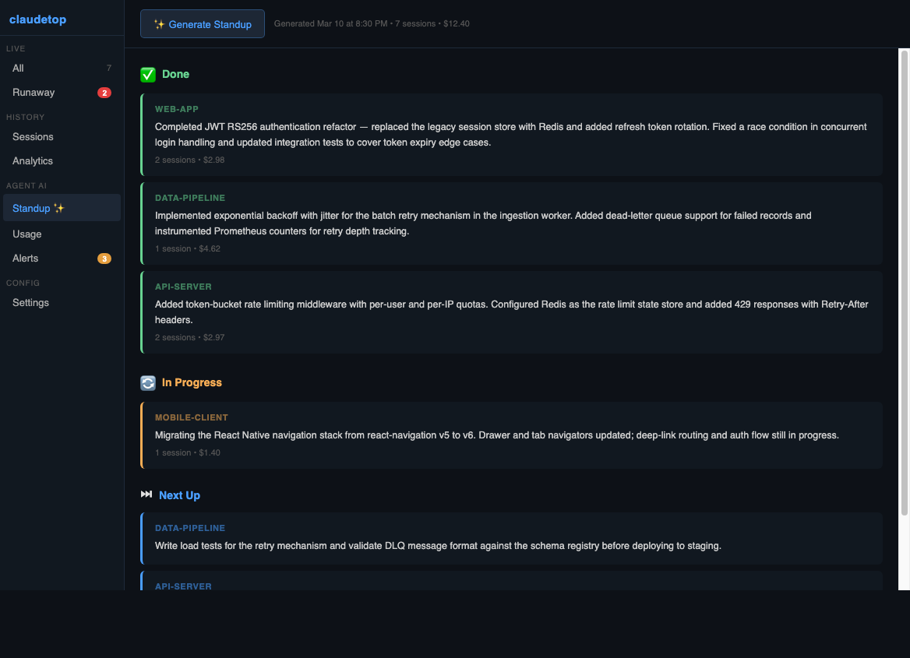

# claudetop

**Real-time process monitor, cost tracker, and AI-powered analytics for [Claude Code](https://claude.ai/code) agents.**

claudetop gives you visibility into every Claude Code session running on your machine — live CPU/memory, token burn rates, historical costs, session summaries, and AI-generated standup reports. Available as both a desktop app (Electron) and a command-line tool.

---

## Features

### Live Process Monitoring
- See all active Claude Code processes with CPU, memory, runtime, and working directory
- Detect **runaway processes** (memory > 2 GB or runtime > 24 h) with one-click kill
- Detect **orphaned subprocesses** — tools spawned by an agent that kept running after Claude exited
- Track **API idle time** — how long since the process last wrote to its session file
- See **parent/child relationships** between Claude processes and the subtools they launch

### Token Burn Rate Alerts
- Real-time monitoring of tokens/minute across all active sessions
- Three alert tiers: **high-rate** (single spike), **sustained** (3+ consecutive windows), **session cost exceeded**
- Desktop notifications with $/hour projection
- Configurable thresholds and alert cooldown

### Session History & Analytics
- Every Claude Code session is automatically indexed into a local SQLite database
- Browse sessions by project, date range, or model
- Full cost breakdown: input tokens, cache writes, cache reads, output tokens × per-model pricing
- Daily cost bar chart, top projects by spend, cost by model

### AI-Powered Standup Reports
- One-click standup generation: Done / In Progress / Next Up / Blockers
- Built from recent session data: git commits, session costs, what you asked Claude to do
- Streams output in real time while generating
- Uses Claude CLI auth (Keychain) — no extra API key needed by default

### Session Summarization
- Summarize any individual session with one click
- Reads conversation history from the JSONL file and returns a 2–3 sentence summary

### Process Analysis
- AI analysis of any flagged process — is it legitimately working, idle, or stuck in a loop?
- Recommends: **leave / investigate / kill**

### Scope Warnings
- Detects project directories with no `.claudeignore` that risk excessive token consumption
- Severity: info / warning / critical based on readable file count
- Desktop notifications when a new session starts in a risky directory

### Security Scanning
- Audits network connections for each Claude process (`lsof -i`)
- Flags connections to unexpected hosts (anything outside `api.anthropic.com`, `sentry.io`, `statsig.com`, `localhost`)
- Flags access to sensitive files (`/etc/passwd`, `~/.ssh/`, etc.)

### Settings & Permissions
- Check and open system permissions (Full Disk Access, Notifications) from within the app
- Configure token burn thresholds and alert cooldown
- Optional Anthropic API key for fallback if Claude CLI auth is unavailable
- Test notification button

---

## Screenshots

> Desktop app — process list with runaway detection, detail panel with analyze + kill



> Session history with per-token cost breakdown



> AI standup streaming output



---

## Requirements

| Requirement | Notes |
|-------------|-------|
| **macOS 13+** | Electron app is macOS-primary; Linux supported for CLI |
| **Node.js ≥ 20** | |
| **pnpm ≥ 10** | `npm install -g pnpm` |
| **Claude Code** | `claude` CLI must be installed and authenticated |
| **Full Disk Access** | Required to read process working directories via `lsof` |
| **Notifications** (optional) | For burn-rate and scope warning alerts |
| **Anthropic API key** (optional) | Fallback if Claude CLI auth is unavailable; configure in Settings |

---

## Installation

```bash
git clone https://github.com/your-username/claudetop.git
cd claudetop
pnpm install
pnpm build       # builds all packages (core + app + cli)
```

### Desktop App

```bash
# Development (hot-reload)
pnpm --filter app dev

# Package as a distributable .app / DMG
pnpm --filter app package
# → packages/app/dist/release/
```

After first launch, grant **Full Disk Access** in System Settings → Privacy & Security → Full Disk Access. The app will prompt you if the permission is missing.

### CLI

```bash
pnpm --filter cli build

# Add to PATH
export PATH="$PATH:$(pwd)/packages/cli/dist"

claudetop list          # show all Claude processes
claudetop watch         # live-updating process table
claudetop sessions      # browse session history
claudetop report        # cost report
claudetop standup       # AI standup
```

---

## CLI Reference

```
claudetop [command] [options]

Commands:
  list                    List all Claude Code processes (default)
  watch                   Live-updating process table
  inspect <pid>           Detailed view of a process
  kill <pid>              Send SIGTERM to a process
  killall                 Kill all Claude Code processes
  logs <pid>              Tail process output
  scan [pid]              Security audit (network + file access)
  sessions [sessionId]    Browse indexed session history
  report                  Cost report by project / model / date
  standup                 Generate AI standup from last 24h sessions
  prune                   Remove orphaned processes and stale session entries

Options (sessions):
  --project <name>        Filter by project name
  --since <period>        Time range: 1d, 7d, 30d (default: 7d)
  --limit <n>             Max results (default: 50)
  --json                  Output JSON

Options (report):
  --period day|week|month
  --project <name>
  --json
```

---

## Desktop App Navigation

| Section | View | Description |
|---------|------|-------------|
| **Live** | All | All Claude processes |
| | Runaway | Processes exceeding memory/runtime thresholds |
| **History** | Sessions | Searchable session table with cost breakdown |
| | Analytics | Cost charts by day, project, and model |
| **Agent AI** | Standup ✨ | AI-generated standup report |
| | Usage | 30-day LLM spend summary |
| | Alerts | Active burn-rate, scope, and orphan alerts |
| **Config** | Settings | Permissions, thresholds, API key |

### Process Actions
- **Click** a process row to open the detail panel
- **Analyze** — ask Claude to assess whether the process is legitimately working or stuck
- **Kill** — SIGTERM (graceful shutdown)
- **Force Kill** — SIGKILL (immediate)

---

## How It Works

### Session Indexing

Claude Code stores every session as a JSONL file under `~/.claude/projects/`. claudetop runs a background indexer (worker thread) that watches this directory with [chokidar](https://github.com/paulmillr/chokidar), parses new files as they appear, extracts token usage and metadata, and stores them in a local SQLite database (`~/.claudetop/sessions.db`).

The indexer reads:
- Model name
- Input / output / cache read / cache write token counts
- Git branch
- Working directory
- Session start time and duration
- Whether the session is a sidechain (sub-agent spawned by the main agent)

### Token Cost Calculation

Costs are calculated using Anthropic's published pricing (updated Feb 2026):

| Model | Input | Cache Write | Cache Read | Output |
|-------|-------|-------------|------------|--------|
| claude-opus-4-6 | $5/M | $6.25/M | $0.50/M | $25/M |
| claude-sonnet-4-6 | $3/M | $3.75/M | $0.30/M | $15/M |
| claude-haiku-4-5 | $0.80/M | $1.00/M | $0.08/M | $4/M |

### AI Features

All AI features (Analyze, Summarize, Standup) use the **Claude CLI** by default — meaning they authenticate using your existing Keychain credentials with no extra setup. If the CLI is unavailable, they fall back to:

1. API key in `~/.claudetop/settings.json` (configured via Settings)
2. API key in `~/.claude/credentials.json` or `~/.claude/config.json`
3. `ANTHROPIC_API_KEY` environment variable

The model used for insights is `claude-sonnet-4-6`. Typical costs:
- Standup: ~$0.003
- Session summary: ~$0.001
- Process analysis: ~$0.001

### Runaway Detection

A process is flagged as runaway if it exceeds configurable thresholds. Defaults:
- Memory RSS > 2 GB
- Runtime > 24 hours

A process is flagged as **orphaned** if its parent PID is 1 (re-parented to init) and its working directory matches a known Claude Code project directory — meaning Claude exited but a subprocess it spawned kept running.

---

## Data & Privacy

- **All data stays local.** No telemetry, no remote analytics, no account required.
- Session data is read from `~/.claude/projects/` (written by Claude Code) and stored in `~/.claudetop/sessions.db`.
- AI feature calls go to `api.anthropic.com` using your own API key or Claude CLI credentials.
- Settings are stored in `~/.claudetop/settings.json`.

---

## Development

### Project Structure

```
claudetop/
├── packages/
│   ├── core/           # Shared TypeScript library
│   │   └── src/
│   │       ├── processes.ts      # Process listing & detection
│   │       ├── sessions.ts       # JSONL parsing & cost calculation
│   │       ├── analytics.ts      # SQLite queries
│   │       ├── insights.ts       # LLM client (CLI + SDK)
│   │       ├── tokenMonitor.ts   # Real-time burn rate monitoring
│   │       ├── standup.ts        # Standup report generator
│   │       ├── summarize.ts      # Session summarizer
│   │       ├── analyzeProcess.ts # Process analyzer
│   │       ├── scopeWarnings.ts  # Scope warning detector
│   │       ├── scan.ts           # Security scanner
│   │       ├── indexer.ts        # JSONL file indexer
│   │       ├── db.ts             # SQLite schema & helpers
│   │       └── types.ts          # Shared interfaces
│   ├── app/            # Electron desktop app (React + Vite)
│   │   ├── electron/
│   │   │   ├── main.ts           # Main process & IPC handlers
│   │   │   └── preload.ts        # Context-isolated IPC bridge
│   │   └── src/
│   │       ├── App.tsx
│   │       ├── hooks/
│   │       └── components/
│   └── cli/            # Command-line interface (Ink + Commander)
│       └── src/
│           ├── index.ts
│           └── commands/
├── tsconfig.base.json
└── pnpm-workspace.yaml
```

### Tech Stack

| Layer | Technologies |
|-------|-------------|
| Core library | TypeScript, systeminformation, better-sqlite3, chokidar, node-pty, @anthropic-ai/sdk |
| Desktop app | Electron, React 18, Vite, recharts, electron-builder |
| CLI | Commander.js, Ink (React TUI), chalk |

### Running Tests

```bash
pnpm test           # all packages
pnpm --filter core test
```

### Building for Distribution

```bash
pnpm --filter app package
# Produces: packages/app/dist/release/claudetop-<version>-arm64.dmg
```

---

## Contributing

1. Fork the repo and create a branch
2. `pnpm install`
3. Make changes — `pnpm --filter app dev` for live reload
4. Run `pnpm test` and `pnpm build` to verify
5. Open a PR

Please keep PRs focused and match the existing code style (TypeScript strict mode, no `any` where avoidable).

---

## License

MIT
